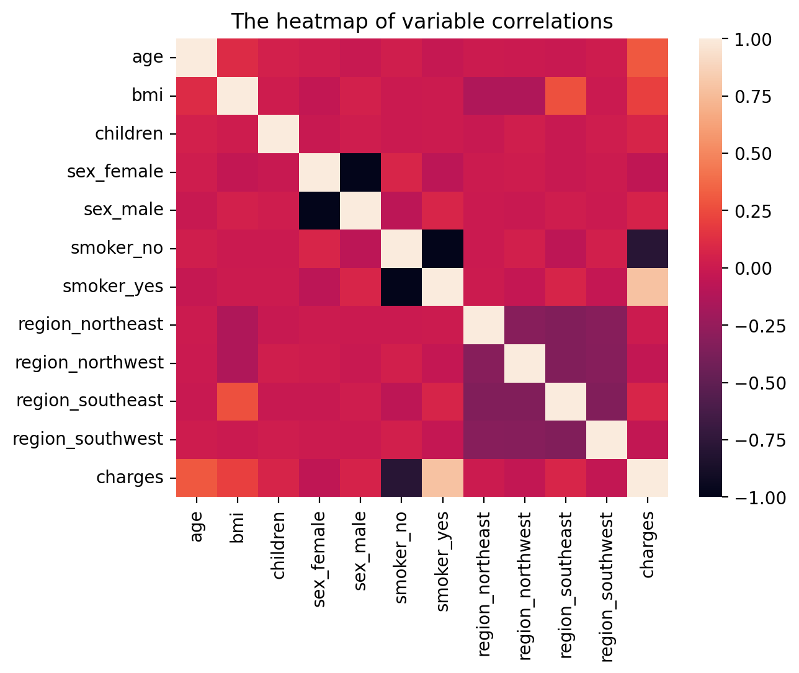
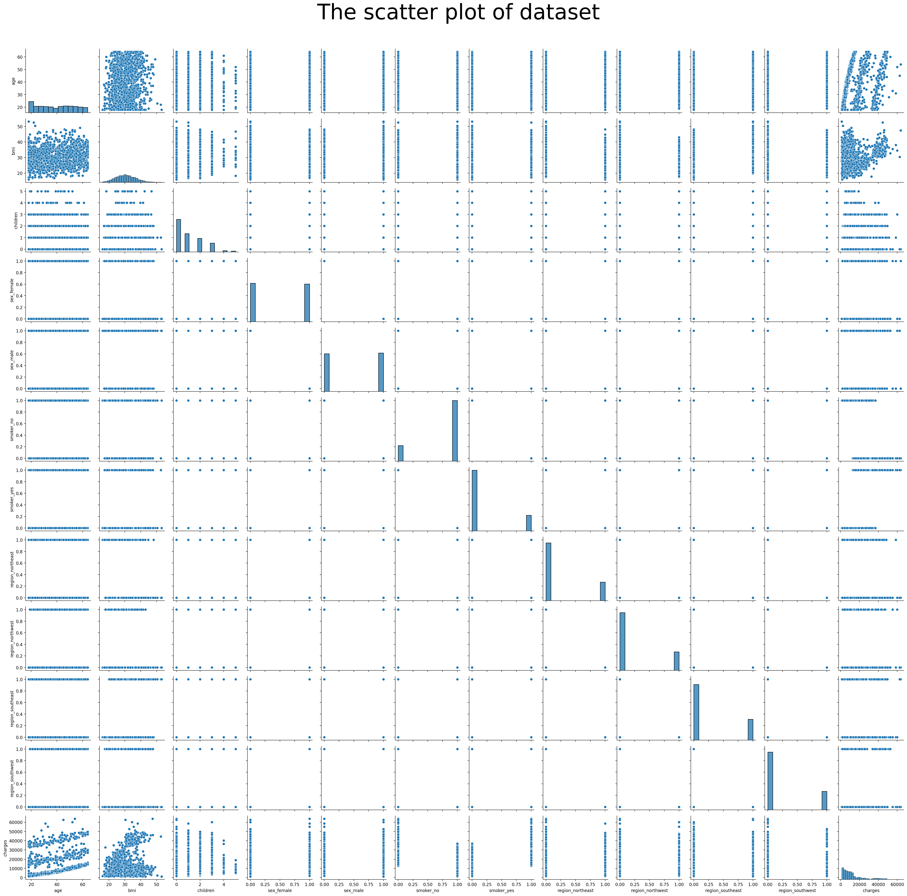
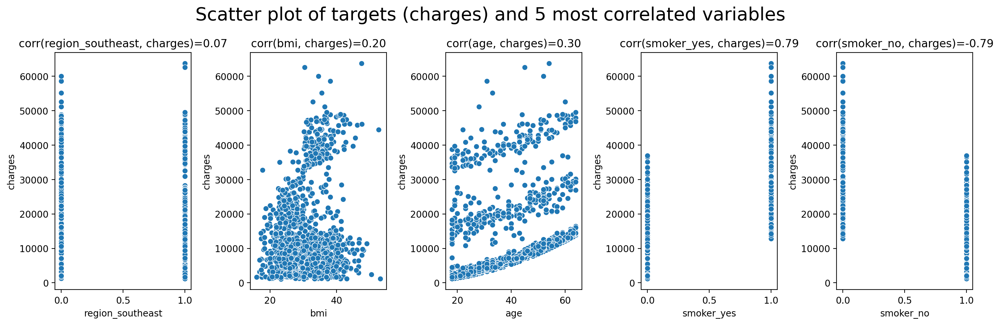
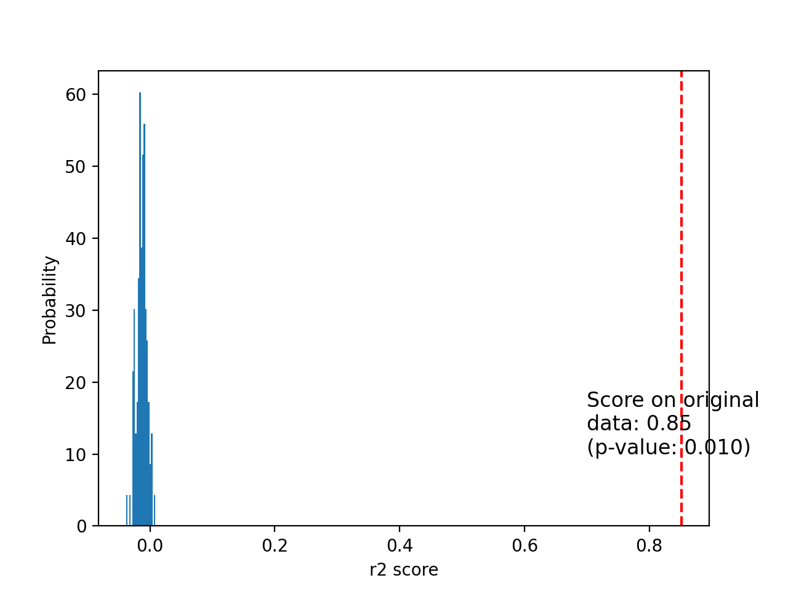

# Structured Data Analysis and Regression Template
This repository includes the code for data analysis and fits several machine learning regression models on the dataset.

## Environment Preparation and Code Execution
***The code requires at least `python 3.10` to run.***

First, create a virtual environment and install the requirements:
```sh
python -m venv venv
source venv/bin/activate
python -m pip install -r requirements.txt
```
Then, execute the code:
```sh
python main.py
```
After the code execution is finished, the results are saved in `texts` and `figs` directories.
## Code Structure
The structure of the code is as follows:
```
main.py
src
├── constants.py
├── data_analysis.py
├── hparam_search.py
├── __init__.py
├── metrics.py
├── model.py
└── utils.py
texts
├── dataset_description.txt
├── model_metrics.txt
└── p_value_calculations.txt
figs
├── best_model_permutation_test_score.png
├── correlated_scatterplot.png
├── correlation.png
└── full_scatterplot.png
```
The code is executed by running `main.py`. The dataset and hyperparameters range could be altered in `src/constant.py`. The execution results are saved in `figs` and `texts`.
## Data Analysis
The dataset stats are exported in form of texts and figures:
* **feature stats**: `texts/dataset_description.txt` includes each column's primitive stats
* **feature significance**: `texts/p_value_calculations.txt` includes p-values calculated by fitting the ordinary least squares model. The p-values of each feature show the real dependency between the target and the feature. A small p-value rejects the null hypothesis (i.e., there is no real dependency between the target and the feature).
* **correlation map**: `figs/correlation.png` depicts the correlation heatmap between dataset columns.
* **full scatterplot**: `figs/full_scatterplot.png` depicts a full mutual scatterplot of columns. The diagonal plots show the histogram of the corresponding column. 
* **most correlated scatterplot**: `figs/correlated_scatterplot.png` depicts the mutual scatterplot of each target and the most correlated features.

## Regression and Hyperparameter optimization
Currently, the code supports the scikit-learn estimators for regression tasks. The regression models include:
* [LinearRegression](https://scikit-learn.org/stable/modules/generated/sklearn.linear_model.LinearRegression.html)
* [RandomForestRegressor](https://scikit-learn.org/stable/modules/generated/sklearn.ensemble.RandomForestRegressor.html)
* [Ridge](https://scikit-learn.org/stable/modules/generated/sklearn.linear_model.Ridge.html)
* [Lasso](https://scikit-learn.org/stable/modules/generated/sklearn.linear_model.Lasso.html)
* [MLPRegressor](https://scikit-learn.org/stable/modules/generated/sklearn.neural_network.MLPRegressor.html)

The code uses scikit-learn's `GridSearchCV` for selecting the best hyperparameters of each model. The grid search settings could be altered in `src/constants.py` file.

### Hyperparameter Selection
The code performs a hyperparameter grid search for each model type and calculates the error metrics of the best hyperparameters of each model in terms of the lowest mean squared error (***MSE***). Each model's error metrics are reported in `texts/model_metrics.txt`.

### Best model evalutaion
The code finally constructs an end-to-end pipeline for estimating the targets with raw features. The pipeline is created with the model with the least ***MSE*** in `texts/model_metrics.txt`.

A [permutation test score](https://scikit-learn.org/stable/modules/generated/sklearn.model_selection.permutation_test_score.html) analysis is also done on the best model. In the permutation test score analysis, dataset targets are permuted to generate random targets, then, the empirical p-value is calculated to evaluate the null hypothesis (i.e., there is no real dependency between features and targets). A small p-value rejects the null hypothesis and shows the real dependency between features and targets. The score distribution of model training with different target permutations along with the results of training the model with the original data is shown in `figs/best_model_permutation_test_score.png`.

## Medical Cost Dataset Example
The aim is to estimate the individual medical costs billed by health insurance in [Medical Cost Personal Dataset](https://www.kaggle.com/datasets/mirichoi0218/insurance). The dataset columns are:
* **age**: age of primary beneficiary
* **sex**: insurance contractor gender, female, male
* **bmi**: Body mass index, providing an understanding of body, weights that are relatively high or low relative to height, objective index of body weight (kg / m ^ 2) using the ratio of height to weight, ideally 18.5 to 24.9
* **children**: Number of children covered by health insurance / Number of dependents
* **smoker**: Smoking
* **region**: the beneficiary's residential area in the US, northeast, southeast, southwest, northwest.
* **charges**: Individual medical costs billed by health insurance

### Medical Cost Data Analysis
The dataset stats are as follows:
* **feature stats**: The dataset includes 4 numerical and 3 categorical columns.
```
             age        bmi   children   sex smoker     region     charges
count   1338.000  1338.0000  1338.0000  1338   1338       1338   1338.0000
unique       NaN        NaN        NaN     2      2          4         NaN
top          NaN        NaN        NaN  male     no  southeast         NaN
freq         NaN        NaN        NaN   676   1064        364         NaN
mean      39.207    30.6634     1.0949   NaN    NaN        NaN  13270.4223
std       14.050     6.0982     1.2055   NaN    NaN        NaN  12110.0112
min       18.000    15.9600     0.0000   NaN    NaN        NaN   1121.8739
25%       27.000    26.2962     0.0000   NaN    NaN        NaN   4740.2872
50%       39.000    30.4000     1.0000   NaN    NaN        NaN   9382.0330
75%       51.000    34.6938     2.0000   NaN    NaN        NaN  16639.9125
max       64.000    53.1300     5.0000   NaN    NaN        NaN  63770.4280
```
* **feature significance**: The features with the lowest p-values are age, bmi, children, and smoker. There is a real dependency between the mentioned features and charges. Refer to [this](https://www.geeksforgeeks.org/interpreting-the-results-of-linear-regression-using-ols-summary/) link for more detail about interpreting the summary.
```
p-values for target charges:
                            OLS Regression Results                            
==============================================================================
Dep. Variable:                charges   R-squared:                       0.751
Model:                            OLS   Adj. R-squared:                  0.749
Method:                 Least Squares   F-statistic:                     500.8
Date:                Wed, 12 Apr 2023   Prob (F-statistic):               0.00
Time:                        21:34:28   Log-Likelihood:                -13548.
No. Observations:                1338   AIC:                         2.711e+04
Df Residuals:                    1329   BIC:                         2.716e+04
Df Model:                           8                                         
Covariance Type:            nonrobust                                         
====================================================================================
                       coef    std err          t      P>|t|      [0.025      0.975]
------------------------------------------------------------------------------------
constant          -296.4168    430.507     -0.689      0.491   -1140.964     548.130
age                256.8564     11.899     21.587      0.000     233.514     280.199
bmi                339.1935     28.599     11.860      0.000     283.088     395.298
children           475.5005    137.804      3.451      0.001     205.163     745.838
sex_female         -82.5512    269.226     -0.307      0.759    -610.706     445.604
sex_male          -213.8656    274.976     -0.778      0.437    -753.299     325.568
smoker_no        -1.207e+04    282.338    -42.759      0.000   -1.26e+04   -1.15e+04
smoker_yes        1.178e+04    313.530     37.560      0.000    1.12e+04    1.24e+04
region_northeast   512.9050    300.348      1.708      0.088     -76.303    1102.113
region_northwest   159.9411    301.334      0.531      0.596    -431.201     751.083
region_southeast  -522.1170    330.759     -1.579      0.115   -1170.983     126.749
region_southwest  -447.1459    310.933     -1.438      0.151   -1057.119     162.827
==============================================================================
Omnibus:                      300.366   Durbin-Watson:                   2.088
Prob(Omnibus):                  0.000   Jarque-Bera (JB):              718.887
Skew:                           1.211   Prob(JB):                    7.86e-157
Kurtosis:                       5.651   Cond. No.                     3.80e+17
==============================================================================

Notes:
[1] Standard Errors assume that the covariance matrix of the errors is correctly specified.
[2] The smallest eigenvalue is 2.44e-29. This might indicate that there are
strong multicollinearity problems or that the design matrix is singular.
```
* **correlation map**:

* **full scatterplot**:

* **most correlated scatterplot**: The most correlated features to charges are bmi, age, region_southeast, smoker_yes, and smoker_no.


### Medical Cost Regression
The error metrics of each model after hyperparameter optimization is as follows:
```
{'Lasso': Metrics(mse=38832665.20528848,
                  mae=4419.539067814349,
                  r2_score=0.7559688657081449),
 'Linear': Metrics(mse=31875967.663214467,
                   mae=3976.679340473984,
                   r2_score=0.7996859472719023),
 'Multi Layer Perceptron': Metrics(mse=18768808.065320987,
                                   mae=2887.5993151156094,
                                   r2_score=0.8820535882027835),
 'Random Forrest': Metrics(mse=17231665.817206744,
                           mae=2569.5663688336904,
                           r2_score=0.8917132539607795),
 'Ridge': Metrics(mse=31840450.622270897,
                  mae=3934.688870825487,
                  r2_score=0.7999091424541627)}
```
The Random Forrest model with hyperparameters `{'max_depth': 3, 'n_estimators': 120}` has the least ***MSE*** error and is selected as the model of choice. The permutation test score analysis on the Random Forrest model is shown below.

The blue bars show the $R^2$ score distribution of models trained on permuted targets. These models mostly score negative values, meaning a mean constant estimator could score higher than them. The red vertical line shows the $R^2$ score that the model trained on the original data has obtained. The $R^2$ score is closer to 1, meaning the model could predict the targets given the features.